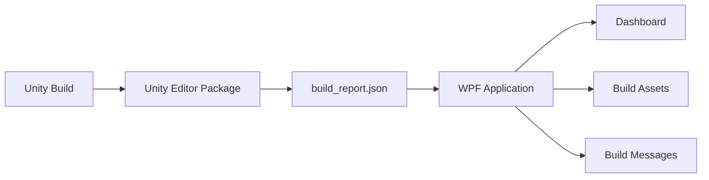

# Unity Project Inspector

Unity 프로젝트를 열지 않고도 프로젝트 정보와 최근 빌드 결과를 확인할 수 있는 Windows용 WPF 분석 도구입니다.

Unity Editor 패키지가 빌드 결과를 JSON으로 내보내고, WPF 애플리케이션이 해당 파일을 읽어 프로젝트 용량, 빌드 요약, 포함 Asset과 Warning/Error를 표시합니다.


## 주요 기능

### Dashboard

- Unity 프로젝트명, 경로와 Unity 버전 표시
- 프로젝트 전체 용량, 소스 용량, Assets 용량 계산
- 최근 빌드 결과, 플랫폼, 산출물 크기와 빌드 시간 표시
- Warning/Error 개수 표시
- Asset Type별 포함 용량과 비율 표시

### Build Assets

- BuildReport에 포함된 Asset 목록 표시
- Name과 Path 검색
- Asset Type 필터
- Name, Type, Packed Size 기준 정렬
- 대량 목록을 위한 DataGrid 가상화

### Build Messages

- Warning과 Error 목록 표시
- 메시지 내용 검색과 Type 필터
- Warning은 주황색, Error는 빨간색으로 구분

### 프로젝트 처리

- Unity 프로젝트 폴더 검증
- 마지막으로 선택한 프로젝트 자동 불러오기
- 프로젝트 분석 중 전체 화면 로딩 표시
- 새로운 BuildReport를 읽는 새로고침 기능
- BuildReport가 없을 때 Unity 패키지 설치 상태 확인
- 패키지 설치 주소 선택 및 복사 지원

## 동작 구조



Unity 패키지는 다음 위치에 Schema 2 형식의 보고서를 생성합니다.

```text
<UnityProject>/.unityprojectinspector/build_report.json
```

WPF 애플리케이션은 Unity 프로젝트의 `Assets`, `Packages`, `ProjectSettings` 폴더를 확인한 다음 프로젝트 정보와 보고서를 불러옵니다.

## 요구 사항

### WPF 애플리케이션

- Windows
- .NET 9 SDK

### Unity Editor 패키지

- 선언된 최소 Unity 버전: Unity 2022.3
- Git URL 설치 시 Git 2.14 이상

## Unity 패키지 설치

Unity에서 `Window > Package Manager`를 열고 다음 순서로 설치합니다.

1. 왼쪽 위 `+` 버튼 선택
2. `Add package from git URL` 선택
3. 다음 주소 입력

```text
https://github.com/IIBluEll/UnityPackage_Unity_Inspector.git
```

패키지 저장소를 로컬에 내려받았다면 `Add package from disk`에서 `package.json`을 선택할 수도 있습니다.

패키지 정보:

```text
Package ID: com.hm.unity-project-inspector
Current Version: 0.2.2
Schema Version: 2
```

Unity 패키지 저장소: [UnityPackage_Unity_Inspector](https://github.com/IIBluEll/UnityPackage_Unity_Inspector)

## 실행 방법

저장소를 내려받은 후 다음 명령을 실행합니다.

```powershell
git clone https://github.com/IIBluEll/WPF_Unity_Inspector.git
cd WPF_Unity_Inspector
dotnet restore
dotnet run --project .\WPF_UnityInspector.csproj
```

빌드만 확인하려면 다음 명령을 사용합니다.

```powershell
dotnet build .\WPF_UnityInspector.sln
```

## 사용 순서

1. 분석할 Unity 프로젝트에 Editor 패키지를 설치합니다.
2. Unity 프로젝트를 한 번 빌드합니다.
3. Unity Project Inspector를 실행합니다.
4. `Select Unity Project`를 눌러 Unity 프로젝트의 루트 폴더를 선택합니다.
5. Dashboard, Build Assets, Messages 화면에서 결과를 확인합니다.
6. Unity에서 다시 빌드했다면 `Refresh`를 눌러 최신 보고서를 불러옵니다.

최근 BuildReport를 수동으로 다시 내보내려면 Unity 메뉴에서 다음 항목을 실행합니다.

```text
Tools > Unity Project Inspector > Export Latest Build Report
```

## 표시값 기준

| 표시값 | 기준 |
| --- | --- |
| Project | 선택한 Unity 프로젝트 루트 폴더명 |
| Unity Version | `ProjectSettings/ProjectVersion.txt`의 `m_EditorVersion` |
| Project Disk | 프로젝트 루트에 존재하는 파일 크기 합계 |
| Project Source | `Assets`, `Packages`, `ProjectSettings`의 파일 크기 합계 |
| Assets | `Assets` 폴더의 파일 크기 합계 |
| Artifact Size | Unity 빌드 출력 경로에 존재하는 파일 또는 디렉터리 크기 |
| Packed Size | Unity `PackedAssetInfo.packedSize`를 Asset 경로별로 합산한 값 |
| Report Generated | JSON 보고서를 내보낸 시각 |

`Project Disk`, `Project Source`, `Assets` 계산에서는 재분석 지점을 따라가지 않습니다. 접근할 수 없는 항목이 있으면 화면에 부분 계산 상태를 표시합니다.

Warning/Error 개수는 Inspector 자체 로그를 제외하고 화면에 표시하는 메시지 개수입니다. Unity `BuildSummary`가 보고한 원본 개수와 다를 수 있습니다.

Windows Standalone 빌드에서 Unity의 출력 경로가 EXE 파일을 가리키면 `Artifact Size`에는 EXE와 함께 생성되는 Data 폴더가 포함되지 않습니다.

## 프로젝트 구조

```text
WPF_Unity_Inspector
├─ Models
│  ├─ BuildReportData.cs
│  ├─ AssetTypeSummary.cs
│  └─ ProjectSizeResult.cs
├─ Services
│  ├─ BuildReportService.cs
│  ├─ ProjectFileService.cs
│  ├─ ProjectSettingsService.cs
│  └─ ProjectSizeService.cs
├─ ViewModels
│  └─ DashboardViewModel.cs
├─ Views
│  ├─ DashboardView.xaml
│  ├─ BuildAssetsView.xaml
│  ├─ MessagesView.xaml
│  └─ PackageInstallationDialog.xaml
├─ docs
│  ├─ Planning.md
│  └─ VERIFICATION_2026-09-18.md
├─ MainWindow.xaml
└─ WPF_UnityInspector.csproj
```

현재는 세 화면이 하나의 `DashboardViewModel`을 공유합니다. View는 `UserControl`로 분리했으며, 기능 경계가 안정된 뒤 ViewModel을 화면별로 나눌 수 있습니다.

## 데이터와 설정 위치

BuildReport:

```text
<UnityProject>/.unityprojectinspector/build_report.json
```

최근 프로젝트 경로:

```text
%LocalAppData%/HM/UnityProjectInspector/last-project.txt
```

`.unityprojectinspector`의 JSON을 형상 관리하지 않는다면 Unity 프로젝트의 `.gitignore`에 다음 항목을 추가할 수 있습니다.

```gitignore
.unityprojectinspector/
```

## 현재 검증 상태

Unity 6000.3.20f1에서 다음 항목을 확인했습니다.

- Editor가 열린 상태의 Windows 성공 빌드 자동 내보내기
- 배치 모드 Windows 성공 빌드 자동 내보내기
- 빌드 결과, 빌드 시간, 출력 크기와 UTC 시각 기록
- 실제 Android BuildReport의 Asset 2,945개 경로별 Packed Size 집계
- WPF Schema 2 JSON 로드와 예외 입력 처리
- WPF 프로젝트 빌드 성공

아직 확인하지 않은 항목:

- Unity 2022.3에서의 패키지 설치와 빌드
- 패키지 v0.2.2 적용 후 Android 자동 내보내기
- 사용자가 진행 중인 빌드를 취소했을 때의 보고서 처리

빌드 전 단계에서 실패하면 Unity의 후처리 콜백이 실행되지 않아 기존 JSON이 그대로 남을 수 있습니다.

자세한 검증 범위와 결과는 [검증 기록](docs/VERIFICATION_2026-09-18.md)을 참고하세요.

## 기술 스택

- C#
- .NET 9
- WPF / XAML
- CommunityToolkit.Mvvm 8.4.2
- System.Text.Json
- Unity BuildReport API

## 향후 계획

- Build History
- 이전 빌드와 현재 빌드 비교
- Asset별 용량 변화 분석
- Asset Dependency 분석
- Missing Reference와 Missing Script 진단
- 배포용 단일 실행 파일과 설치 프로그램
